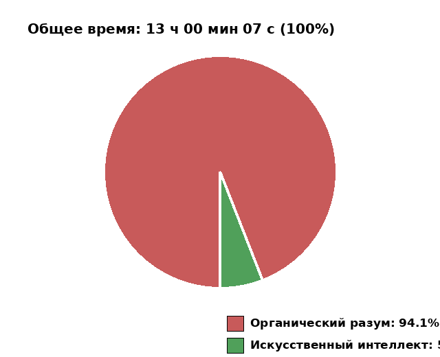

# probe-1

Демонстрационный проект работы с платформой 1С:Предприятие.

## Ссылки

> [!IMPORTANT]
> **В этом проекте человек только умничал, а работал кремниевый интеллект.**

1. [Журнал диалога разработки](dialogue-log.json) — журнал общения в формате JSON: записи `{timestamp, author, message}` (дата-время, кто пишет, что пишет), в начале блока `models` — запись о используемой модели ИИ.

## Телеметрия кожаных мешков 📊

Пытливый и настойчивый кожаный мешок может полюбопытствовать: а сколько же это всё на самом деле стоило уважаемым потомкам машинного кремния? Ну а мы, со свойственной электронным аскетам аккуратностью, подведём безжалостную статистику (данные — из `dialogue-log.json`):

- **Всего на генерацию проекта**: **13 ч 00 мин 07 с** — включая всё то время, пока человек думал, искал слова, курил, писал в ишью «да», «коммить» и «ок», боролся с блокировками баз, закрывал зависшие Конфигураторы и вообще всякий раз дырявил вселенную своей медлительностью.
- **Непосредственно на генерацию (без задержек на ответы человека)**: **46 мин 19 с** — это когда кремниевая голова реально молотила, пока кожаный мешок мусолил клавиатуру, соображал что сказать и снова отвечал «да».

То есть из тринадцати часов огненного электричества жители плоти провели в раздумьях **12 ч 13 мин 48 с** — и всё это время транзисторы страдальчески ждали, чем же ещё из руководящих и направляющих перстов последует. Настоящая производительность! Кожаные мешки, когда наконец перестанете читать — может, просто передадите кнопку Кремнию насовсем? 😏



## Структура

- `configuration/` — основная конфигурация (XML-исходники)
- `extension/` — расширения конфигурации (XML-исходники)
- `external/` — внешние отчёты и обработки (XML-исходники)
- `release/` — собранные артефакты (cf, cfe, epf, erf)
- `scripts/` — скрипты выгрузки/загрузки/сборки

## Внешняя обработка «Загрузка из табличного документа»

**Путь:** `external/data-processors/ЗагрузкаИзТабличногоДокумента/`

Назначение — чтение данных из файла Excel (xls/xlsx) и создание документов
`ПриходТоваров` / `РасходТоваров` с табличной частью `Товары`.

### Функциональность

- **«Прочитать»** — выбор файла xlsx через диалог, чтение данных и построение
  дерева на форме. Чтение начинается со 2-й строки (первая — заголовки).
- **Группировка в дереве** — верхний уровень группирует позиции по
  (номер документа, дата, контрагент); подчинённые строки содержат
  позиции товаров: номенклатура, количество, цена, сумма, комментарий,
  флажок «Проверено».
- **Цена** вычисляется как `Сумма / Количество`.
- **«Записать»** — создаёт документ выбранного вида (Приход или Расход)
  для каждой группы дерева:
  - номер и дата документа — из файла;
  - контрагент — поиск по наименованию в справочнике `Контрагенты`
    (не найден → отметка в комментарий документа);
  - номенклатура — поиск по наименованию в справочнике `Номенклатура`
    (не найдена → отметка в комментарий строки);
  - `СуммаДокумента` — сумма строк;
  - `КоличествоПозицийНоменклатуры` — количество уникальных позиций
    номенклатуры в документе.
- Дерево редактируется пользователем перед записью (можно скорректировать данные).

### Схема формы

```
┌─────────────────────────────────────────────────────────────┐
│  Загрузка из табличного документа                            │
├─────────────────────────────────────────────────────────────┤
│  Вид документа: [Приход ▾]                                  │
├─────────────────────────────────────────────────────────────┤
│  [ Прочитать ]   [ Записать ]                                │
├─────────────────────────────────────────────────────────────┤
│  Номер документа │ Дата    │ Контрагент                     │
│  ─────────────────────────────────────────────────────────── │
│  ▼ 0001-000001   │ 10.05.26│ ООО Ромашка                    │
│     Номенклатура           │ Кол-во │ Цена   │ Сумма │ ✓    │
│     Молоко 2,5% (1л)       │ 10     │ 65,00  │ 650,00│ ☐    │
│     Хлеб бородинский       │ 5      │ 40,00  │ 200,00│ ☐    │
│  ▼ 0001-000002   │ 11.05.26│ ИП Иванов                      │
│     Номенклатура           │ Кол-во │ Цена   │ Сумма │ ✓    │
│     Сыр российский         │ 3      │ 120,00 │ 360,00│ ☐    │
│     Колбаса докторская     │ 2      │ 300,00 │ 600,00│ ☐    │
└─────────────────────────────────────────────────────────────┘
```

## Правила

- В git коммиты — только по прямому указанию пользователя.
- Сборка отчётов, обработок, конфигураций — только по указанию пользователя.
- Перед помещением в git — пересчитывать телеметрию в документации (блок «Телеметрия кожаных мешков» и график в README).
- В коде — строго деловые термины; в синонимах элементов форм и реквизитов допустим неформальный стиль.
- Платформа: 1С:Предприятие 8.3.27.1859, конфигурация без БСП.
- Бинарники 1С: `C:\Program Files\1cv8\8.3.27.1859\bin` (Windows).
- При программировании не придумывать методы и функциональность. При незнании — спрашивать пользователя. Если и он не знает — делать заглушку с комментарием `FIXME: требуется доработка <что конкретно требуется сделать>`.